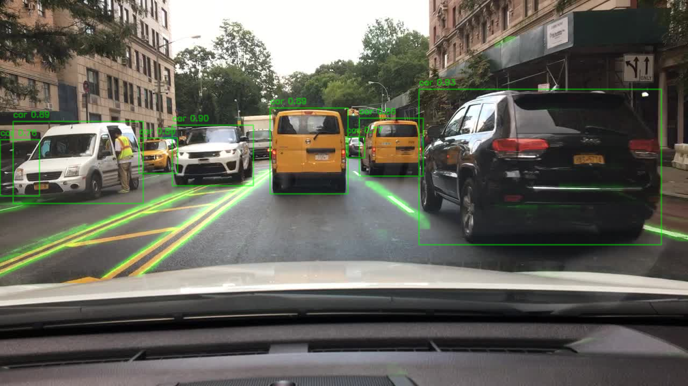
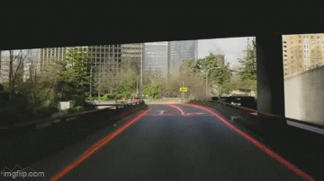

# Part 1: Project Overview
This application analyzes dashcam footage to identify other vehicles, road lanes, and relevant road signs in real-time using Computer Vision algorithms and techniques. It should be able to accuractely perform in many environments and scene conditions. 

## Dataset
For this project, I am choosing to use [Berkeley's DeepDrive Dataset](http://bdd-data.berkeley.edu/download.html) 
(BDD100K). I asked Claude Sonnet to produce five of the most used and modern datasets for training computer 
vision applications for autonomous vehicles, and the top two were [NuScenes](https://www.nuscenes.org/nuscenes) and [DeepDrive](http://bdd-data.berkeley.edu/download.html) . NuScenes is a multi-modal dataset with 3D annotated bounding boxes, but lacks the amount of data that DeepDrive contains. After talking to professor Schreirer, I have chosen to go with DeepDrive as it has more documented use. 

## High-Level Structure
The basic structure of the project pipeline could be as follows: 

**Frame Preprocessing** → **Detection Module** → **Tracking Module** → **Visualization Module**

### Frame Preprocessing
The first would be standard Machine Learning practices for preprocessing and formatting data. This could be standardizes resolutions, color adjustments, noise reductions or normalizations. I took a machine learning class last semester and this was always the first step (I have not dealt with video before so I do not know how it will differ).

### Detection Module
The next step in my approach will be to develop a pipeline that will identitfy objects of interest in a given frame (cars, lanes, signs, pedestrians, etc.). This will be the bulk of the work and therefore the most important module. Here, deep machine learning techniques for classifcation can be used such as reinforcement and active learning frameworks. The model will need to identity lane boundaries by the color (white / yellow), width, and pattern of the line. To find other cars, identifying features would be wheels, rectangular objects, as well as unique aspects of vehicles like license plates. Pedestrians will probably be the trickiest thing to detect because of the variety of cases. Color is not neccessarily important because clothing comes in all colors. The most identifiable attributes would be the tall slender shape most people have compared to other objects, as well as how we move. Signs will also be tricky because while they are uniform, there are many types of signs. It might be reasonable to only identify stop signs for now. The identifiers are easy for this in the U.S, as all stop signs are red and octagonal. All of these detection types could be split into further sub modules to decouple the model. This would be especially useful for signs, as each type could be in its own sub module. Most of these objects do not require extremely high resolutions to identify, and should be considered in implementation.

### Tracking Module
The tracking module would then associate the detections across multiple frames to calculate trajectories and speeds to be passed onto the visualization. 
### Visulization Module
This is the UI of the project that shows what the model is detecting in real time on the footage.

# Part 2: Dataset 
For this project, I am using [Berkeley's DeepDrive Dataset](http://bdd-data.berkeley.edu/download.html) (BDD100K). The Database is split between multiple modes of images and labels. 
First is the actual RGB dashcam images. There come from a variety of environments like highways, urban, and suburban areas. 
The dataset is already split between test, train, and val subsets for a total of 10k images. The second image type is in driveable_areas. These are binary images of
red and blue that demarcate the driveable areas in the RGB dashcam images. The last image type is the segmentation images, which show a semantic segmentation of
the RGB images. In the labels folder, each label is a JSON file that contains the following structure:


    "name": "0000f77c-6257be58",

    "frames": [
        {
            "timestamp": 10000,
            "objects": [
                {
                    "category": "traffic light",
                    "id": 0,
                    "attributes": {
                        "occluded": false,
                        "truncated": false,
                        "trafficLightColor": "green"
                    },
                    "box2d": {
                        "x1": 1125.902264,
                        "y1": 133.184488,
                        "x2": 1156.978645,
                        "y2": 210.875445
                    }
                }, ...

This shows the name of the associated RGB file, all of the frames (which in this case is 1 since I only am using images, not video)
, then the objects associated with that frame. Some of the object categories include, traffic lights, cars, lanes, curbs, and driveable areas.
In terms of each sample, they are all 1280x720. They are taken in a variety of weather conditions which are denotated in the labels.
Cameras are the only sensor used in this dataset (no Lidar or depth cameras). Here is the structure of the dataset in my project files:

    /BDD100K
        /driveable_area
            /color_labels
            /labels
        /images
            /test
            /train
            /val
        /labels
            /test
            /train
            /val
        /segmentation
            /color_labels
            /labels

# Part 3: Preprocessing and Feature Extraction

For my dashcam computer vision application, I applied many methods of preprocessing
and feature extraction. This is split into two classes: FramePreprocessor and FeatureExtractor.
These link together to form the beginning of my computational pipeline. When an image gets passed into
the FramePreprocessor, the first thing that occurs is that a specified percentage of the bottom of the image
is cropped. The reason for this is some of the images have the hood of the car visible in the frame. By removing 
a portion of the bottom of the image, it removes it from consideration in feature extraction and future model 
training. Next, the image is resized. This is done in order to speed up computations by downsampling the frame.
Also, if requested the image is blurred a bit with a Guassian blur. I did this with the goal of denoising parts
of the frame (particular the background), so objects like trees and bushes will not affect the performance of the
application. The last step in the preprocess procedure is to put the image in grayscale. Most objects I am
trying to detect would not benefit from an RGB image so removing a channel makes the most sense.

Next, the preprocessed image is passed onto the FeatureExtractor. I decided to choose three different features to
extract from the image. The first one is mainly for lane detection purposes: the Hough Transform. Before applying it however,
I take a sobel filter on the image to create a mask that only pays attention to vertical lines. Since most lanes 
will only contain vertical lines in the images, I thought it best to ignore horizontal lines completely. Next, I pass
the masked image into a Canny edge detector. I did this because Canny is a established method for edge detection that has 
a good balance between accuracy and noise suppression. It's better than simpler edge detectors because it includes
 gradient calculation, suppression, and thresholding. This results in thinner
and more precise edges, which is ideal for the Hough Transform lane detection. 

This edge data is passed to the Hough Transform,
which creates and draws the complete lines, completeting the feature calculation. The Hough Transform is great for lane detection
because it is specifically designed to detect lines in an image, even in the presence of noise 
or occlusion. This makes it good for real-world driving scenarios, where lane markings may be faded, partially covered 
or interrupted. The transform works by mapping points in the image space to parameter space and identifying 
clusters of points that align to form a line. This means that even fragmented edge segments produced by the Canny detector can be 
aggregated into coherent lane lines, providing a robust way to detect lanes under imperfect visual conditions. Combined with the 
vertical-line-focused Sobel mask and the denoising from preprocessing, the use of Hough Transform here creates a reliable
representation of lanes for this application. 

The next feature I chose to perform a SIFT on the image. Since it picks out all points of interest in an image, I thought it would
be good for identifying things other than the lanes. This feature is good because SIFT is robust to changes in scale, rotation, 
and illumination—conditions. These are common in my dataset. 
SIFT works by detecting keypoints in the image and computing descriptors around them, getting local gradients that can
identify objects. This makes it good for identifying important road objects like 
cars, pedestrians, and traffic signs, even if they appear at different angles or sizes.

The last feature I chose was Histogram Oriented Gradients (HOG). I think this aids in both object recognition and lane detection. 
It is a good addition because HOG captures the overall shape and structure of objects by computing gradient orientation histograms
over localized regions of the image. This makes it effective at detecting objects with consistent, well-defined edges like
 vehicles, pedestrians, and lanes. Unlike SIFT, which is more focused on keypoints and local features, HOG provides a
dense feature representation that emphasizes direction and silhouette information, which is helpful for identifying object
boundaries. It provides structural information about the image that the other two features do not.

Here are some of the results of the three features overlayed on the original image. You can see the canny line detecion,
the hough transform, Histogram Oriented Gradient, and SIFT results.  

1. 

2.

3. 

4.

All of these features have been computed and stored in the project's database under BDD100K/feature_vectors. That folder contains the train test and val
folders containing the features that correspond to each image in the BDD100K/images directory. These will next be passed 
through a classfier to see if these features are sufficient for identification.
# To run the code

To run the code on an image, simply run feature_extractor.py. You can change the test_img_path variable to change which 
image is being processed. Do not run main.py as this will process the whole datset for feature extraction.

# Part 4: Classifications (Lane and Car/Truck detection)

My my lane detection and car classification, I strayed a bit from my previously handcrafted features (SIFT, HOG, Hough, Canny).
When trying to use these previous features for lane classification, I ran into a problem. Since almost all of the training images
contained some sort of lane, it was hard to train an SVM to classify the lanes. This made my pivot to a machine learning nueral
network approach. For this, I constructed a model that contains an encoder with 3 Conv2D layers, which is then fed into a decoder
with 3 ConvTranspose2d layers and a final Conv2D layer. For the model, I chose a ReLU activation function. The accuracy of the
model output is being compared to the 'lane mask' calculated from the JSON labels. An example of one of the masks looks like this:


This is used for the loss calculation using a Binary Cross Entropy (BCE) Loss. I chose to switch to a neural network 
approach because this way, I can get a pixel-by-pixel classification of the lanes rather than classifying the whole image
(which is what the SVM would be doing). The task of lane detection is a segmentation problem, where 
each pixel must be classified as either part of a lane or not. A CNN is well-suited for this because it can learn both local features 
and global context through its architecture. This is particularly important when dealing with complex scenes involving curves, 
intersections, or occluded lanes. For the Neural network Lane detection, the overall Interesection over Union (IoU)
on the training set was 0.3932 and the accuracy was 0.9727. For the validation set, the values were 0.3942 and 0.9727.

The other classifier I used was for the truck/car classification. For this I chose to use a custom trained YOLOv5 model
on the BDD100K dataset. I chose YOLO because of its proven speed and accuracy in real-time object detection. YOLOv5,
in particular, offers an excellent balance between inference speed and detection precision, which is ideal for applications 
like autonomous driving. Its architecture allows for end-to-end detection, meaning it directly outputs bounding boxes and class
probabilities from a single forward pass. For this model on the training set, the Precision was 0.7403 and the Recall was 0.5828. On
the validation set, the Precision was 0.7287 and the Recall was 0.5821. These metrics were chosen because they offer a more balanced 
assessment of performance, especially in cases where the class distribution is imbalanced.

The output of these detections and classifications looked like this:


Combined images look like this:



I also made a class that could process videos that produce outputs like this:


## Model Performance
Both the LaneCNN and YOLOv5 models demonstrate high accuracy on the training set, which is promising but must be carefully
evaluated against validation metrics.

### LaneCNN Model
```
- Training Set: IoU = 0.3932, Accuracy = 0.9727

- Validation Set: IoU = 0.3942, Accuracy = 0.9727
```
While the accuracy remains high and consistent across train and val sets, the Intersection over Union (IoU) is notably low 
. This suggests that the model is likely overpredicting the background or only partially capturing lane pixels. 
High accuracy in this binary segmentation task can be misleading due to class imbalance. The model might be performing 
well on the dominant class (non-lane) but not segmenting lanes precisely.

### YOLOv5 Model
```
- Training Set: Precision = 0.7403, Recall = 0.5828

- Validation Set: Precision = 0.7287, Recall = 0.5821
```
These results indicate modest performance, with recall being the limiting factor. The model detects true positives decently
but misses some objects. Given the similarity in train and val metrics, overfitting isn't a critical issue, but recall 
improvement would improve reliability.

### Interpreting the Results
The near-identical performance between training and validation for both models suggests the networks have not overfit
substantially, but they also haven’t generalized strongly. The LaneCNN’s low IoU combined with high accuracy may point
to the need for better pixel-wise learning and class balancing strategies. The YOLO model's moderate recall hints at
missed detections.

### Improvements for next time
1. Add augmentations such as random noise, brightness/contrast shifts. This might improve robustness and reduce overfitting.
2. Use a different loss function instead of BCE to emphasize 
correct segmentation of the lane pixels. 
3. Increase the number of epochs to better learn the patterns in the data
4. Use a pretrained foundation YOLOv5 model
5. Tune the learning rate

I think that the that implemented #2 and #3 will be the simplest to implement and most impactful for the next report.

# To Run the Code
- To run a combined inference of the YOLO + Lane detection, run ```main.py```. Change the variable ```img_path``` to choose the photo that the inference is run on
- To process a video, run ```run_video.py```. Change the variable ```input_video``` to the path of your input video. The processed video will  be put in the path specified by ```output_video```
- running either ```yolo_inference.py``` or ```lane_inference.py``` will produce either just the lane detection output or YOLO classification of the images in the ```img_path``` variable

# Part 5: Final Deliverable

## Improvements made

As mentioned in the last deliverable, the suggested improvements I implemented were changing the loss function from BCE to a 
combined loss function that integrated both BCE and Dice Loss. I also increased the epochs of training from 20 -> 50. This produced
the following IoU and accuracy on the training and validation set:
```
 Lane Train IOU: 0.3474, Acc: 0.9697
 Lane Val   IOU: 0.3417, Acc: 0.9696
```

Surprisingly, this produced a worse IoU score than before. After doing some thinking, I decided to swap my neural network architecture.
Before, I was using a shallow CNN with no skip connections. Switching to a UNet with 12 epochs took a lot longer to train 
locally (~24hrs) than the previous training time (~10hrs), but provided me with the following IoU and Accuracy on the training and validation sets.
```
Lane Train IOU: 0.5496, Acc: 0.9727
Lane Val   IOU: 0.5314, Acc: 0.9727
```
The difference in performance is very apparent. As you can see by these side by side videos, the one trained
on UNet is far cleaner and better captures the lane lines. The CNN does a fine job on the solid lines, but fails to capture
the dotted lane lines as one solid lane. 

| CNN Trained (50 epochs)                           | UNet Trained (12 epochs) |
|---------------------------------------------------|--------------------------|
|  |                          |
## Testing Database

The test set used for evaluating this system is the official **BDD100K test split**, which was 10,000 high-resolution RGB images. 
The images are sourced from a broad range of real-world driving scenarios like:

- **Scene Types**: City streets, residential neighborhoods, highways.
- **Time of Day**: Daytime, dawn/dusk, and nighttime.
- **Weather Conditions**: Clear, rainy, foggy, and snowy conditions.

### How It Differs from Train/Val Sets

While the overall structure and annotation format of the test set is consistent with the training and validation sets, 
the content includes greater **diversity in scene dynamics** like:

- **Unseen urban settings** 
- **More occluded objects**
- **Poor lighting conditions**

These differences ensure that the test dataset poses meaningful challenges that the training and validation subsets 
may not fully represent, making it an good enough benchmark to evaluate generalization.

### Test Set Results

#### Lane Detection (UNet-based Segmentation)

After switching from a basic CNN to a UNet architecture and retraining with a combined Binary Cross Entropy + Dice loss, the model achieved the following results on the BDD100K **test** subset:
```
Lane Test IOU: 0.5263 

Lane Test Accuracy: 0.9724
```

This performance is slightly **lower** than the validation set (IoU ≈ 0.5314), which is expected due to the harder 
and more varied nature of the test samples. The **IoU improvement** over the shallow CNN (which scored ≈ 0.3417 on val) 
is substantial, reflecting the UNet’s capacity to better capture complex lane structures.

#### Vehicle Detection (YOLOv5)

The YOLOv5 model trained to detect vehicles (cars and trucks) yields:
```
Test Precision: ~0.7032

Test Recall: ~0.5617
```

Though slightly lower than validation performance, the **precision remained high**, while **recall decreased**, likely due to:

- Partial occlusions and truncations.
- Poor lighting or motion blur in test images.
- Presence of small or distant vehicles.

---

### Why Performance Degraded on Test Set

#### Lane Segmentation

- **Class imbalance**
- **Lighting variance**
- **Occlusions**

Examples of failure/bad cases include:

- **Lane curves** on off-ramps and weird lane styles caused blurred detection lines
- 
- **Occlusions**: dark scenes

#### YOLO Detection
- Honestly, even in very blurry and occuluded environments the YOLO model performed very well such as in this case:
- 
---

### Proposed Improvements

1. **Increased epoch training**: Going from 12 epochs -> 25
2. **Better post-processing**: Give better processed images as input to the model during training
3. **Use pretrained backbones**

# To Run the Code
Simply run ```python main.py --mode image``` for images and ```python main.py --mode video``` to process the sample video.
If no flag is given, it will default to images. All you should have to run is main.py!

# Video
The showcase video is labeled FinalVideo.mp4